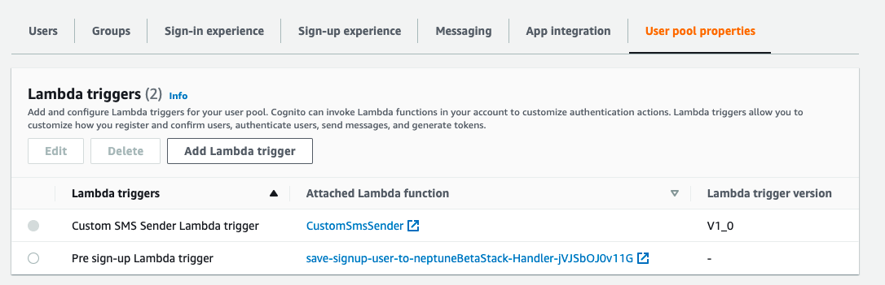

= Creating the CustomSMS Trigger in AWS Cognito using lambda

== Create USER POOL using UI

1. For the Attributes choose `phone numbers` as required attribute and allow both email address and phone number as username.

2. MFA as optional

3. Let console create `IAM` role

4. Create app client

== Create a Custom Lambda Function

* Clone the CustomSmsSender lambda function from https://github.com/m-thirumal/CustomSmsSender[Github]

* Create zip and upload it to AWS 

* Set the environment variables, for more information check the CustomSMSSender https://github.com/m-thirumal/CustomSmsSender/blob/main/README.adoc[README.adoc] file.

== Create a new Symmetric encryption key from KMS.

* Go to AWS Key Management Service [KMS] 

* Create `Symmetric Key`

* Add the lambda `iam` user in the key user

* then update the `key arn`` value into the `lambda env` variables.

=== Grant Amazon Cognito service principal cognito-idp.amazonaws.com access to invoke the Lambda function

[source, shell]
----
aws lambda add-permission --function-name lambda_arn --statement-id "CognitoLambdaInvokeAccess" --action lambda:InvokeFunction --principal cognito-idp.amazonaws.com
----

==== Update user pool to add custom sender Lambda triggers
[source, shell]
----
aws cognito-idp update-user-pool --user-pool-id userpool-id --lambda-config "CustomSMSSender={LambdaVersion=V1_0,LambdaArn= lambda-arn },KMSKeyID= key-id"
----

After executing the above step it will reset the `MFA`, so we need to re-configure it

* Modify `SIGN-IN Experience` to enable user to change

image::./img/sign-in.png[]

* `SIGN-UP Experience`

image::./img/sign-up.png[]

* Lambda name must appears in the `user poll` properties

