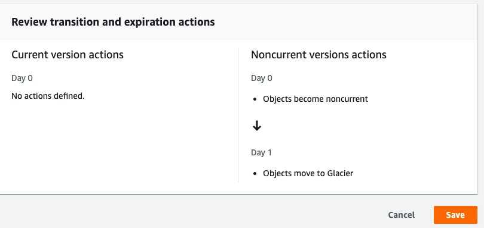

# Lifecycle Rule

1. Select the `bucket` and go to `Management`.
2. Click on `Create lifecycle rule`
3. Fill the details
4. In the `Lifecycle rule actions`,
   1. Move b/w class for versioned/non-current version select `Move noncurrent versions of objects between storage classes`

5. In `Transition noncurrent versions of objects between storage classes`, choose the storage class and select the no.of days to take to move to class `Days after objects become noncurrent`
   

