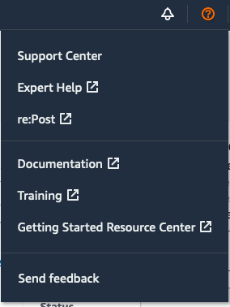
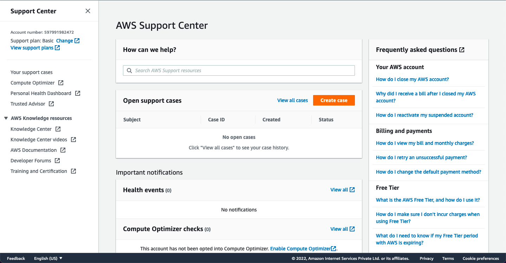

# How to get out of Sandbox and increase AWS sending limits

1. In the AWS Management Console, click on the “Support menu.”
2. Now select “Support Center” from the drop-down menu. 
3. You are now in the “AWS Support Center” page. Click on the “Create case” button.
4. On the “Create case” section, select “Service limit increase.”
5. Then a panel named “Case classification” will show up. Select “SES Sending Limits” from the dropdown menu under “Limit Type.”
6. Choose the type of email that you want to send for “Mail Type.” For example, we selected “Marketing” here. If there are more than one value applies, choose the option that applies to most of the emails that you want to send.
7. Next, “Website URL”-  type the URL of your business website. Providing the website’s URL will help AWS better understand the content you are sending. For example, here we have entered our website address:
8. In “How you will only send to recipients who have specifically requested your mail” – ??
   1. We send emails only to the registered users and to those who have subscribed to our messages.

9.  In “The process that you will follow when you receive bounce and complaint notifications”  
   2.  The software we will be using to send emails through amazonSES will handle the bounce and complaint for us. 
   3.  For bounce: If the bounce is permanent, the software unsubscribes the lead immediately. And no email will be sent in future to that address. If the bounce is not permanent, and the application just stores the response related to the bounce (like timestamp, type, subtype) for future use. 
   4.  For complaint: The application unsubscribes the email address immediately. And no email will be sent in future to that address.

10. In “Will you will comply with AWS Service Terms and AUP,” select “YES.” 
11. Under “Requests” for “Region” select the AWS Region in which you verified your email earlier and have configured the application to use. For example, we’ve chosen – “AP-South 1 (Mumbai)” here.
12. After selecting the “Region” you will see “Limit” choose the type of quota increment that you need to request. There are two options:
    • Desired Daily Send Quota: You can select this option if you want to request an increment in the number of emails that can be sent from your account per 24-hour period in the specified region.
    • Desired Maximum Send Rate: Select this option if you want to request for an increment to the number of emails your account will be able to send each second in that specified region.

13.  For “New limit value” enter the limit that you want to be increased. Request the amount that you think you’ll be in need of. Keep in mind, it is not ensured that you will receive the amount you require. For a new user, we suggest entering 50000, but you can enter a higher number according to your needs.
     1.  Note: You can request a “sending rate increment” at the same time by clicking the “Add Another Request” button. Since Amazon increases the sending rate automatically in accordance with the sending quota, we are skipping this now for simplicity.

14. In the “Case Description” section, for “Use case description” explain how you will use Amazon SES to send emails.
15. Under “Contact options” for “Preferred contact language” select the language you want Amazon to communicate with you. For example, we have selected “English” here.
16. When you are done, click “Submit.”
