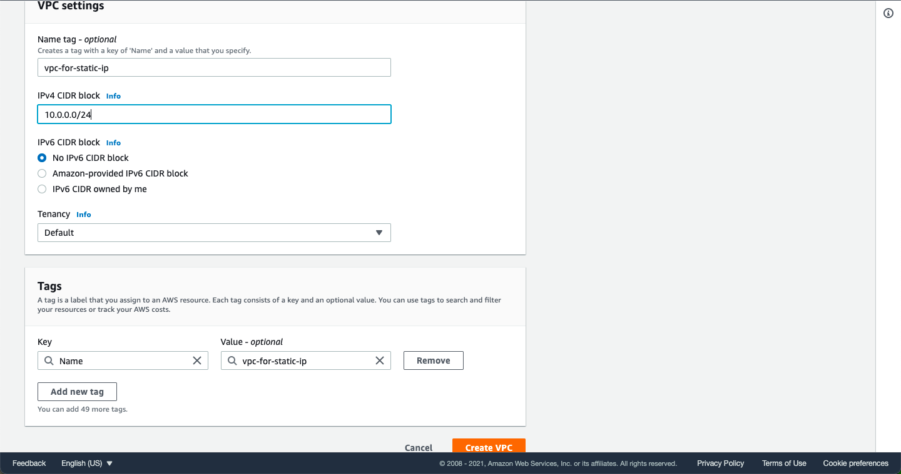
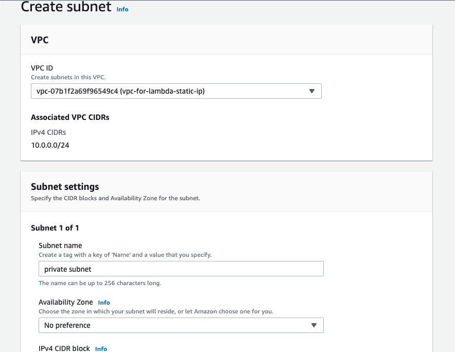
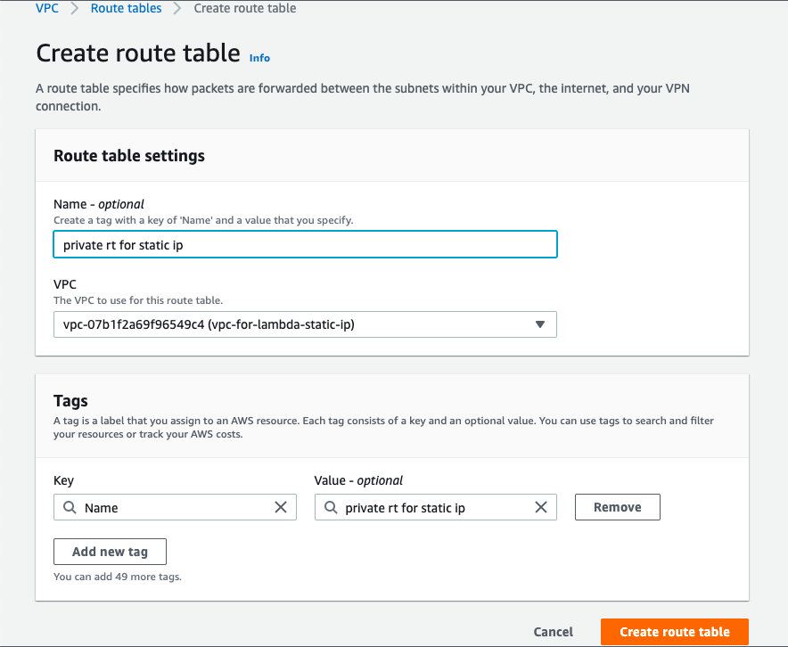
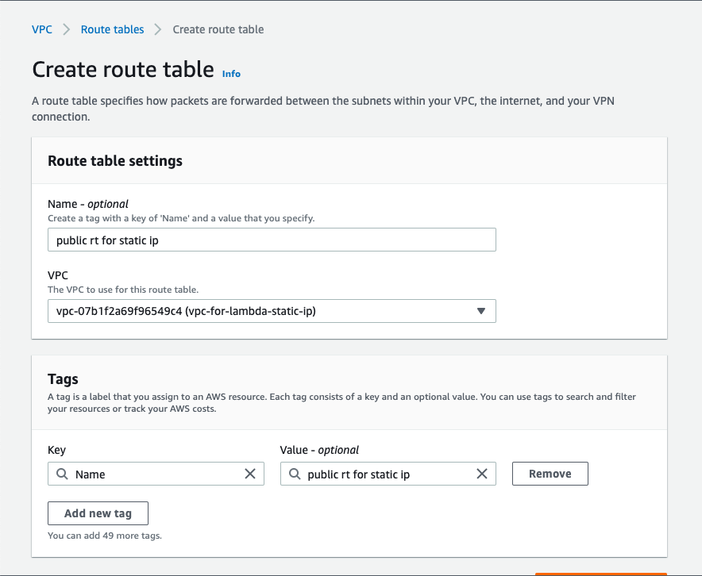
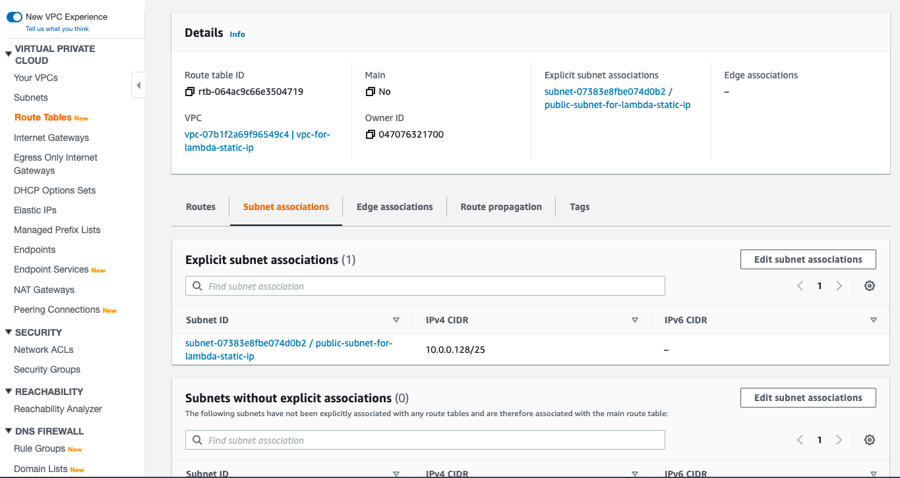

= AWS Lambda functions with a static IP

=== Create VPC

1. Create new VPC.

2. Create `IGW - Internet Gateway` to communicate with the Internet from inside your VPC
    * Attach VPC witn Internet Gateway
image::create_igw.png[Create IGW]

3. Create `private & public subnets` 
    
    * private subnet

    * public subnet

image::public_subnet.png[Public subnet]

4. Create `private and public Route Table`

    * Private Route Table
    * Associate `private subnet`

Associate `private subnet`

image:private_route_table_subnet.png[Private Route Table subnet associate]

    * Public Route Table
        * Create route with destination `0.0.0.0/0` and target `IGW`
        * Associate public route table with public subnet

Create route with destination `0.0.0.0/0` and target `IGW`

image::public_subnet_table_igw.png[Route]

Associate public route table with public subnet

5. Create `NAT Gateway`

    * Select public subnet
    * `Public` connectivity type
    * Select / Create `Elastic IP`

image::nat.png[NAT]

